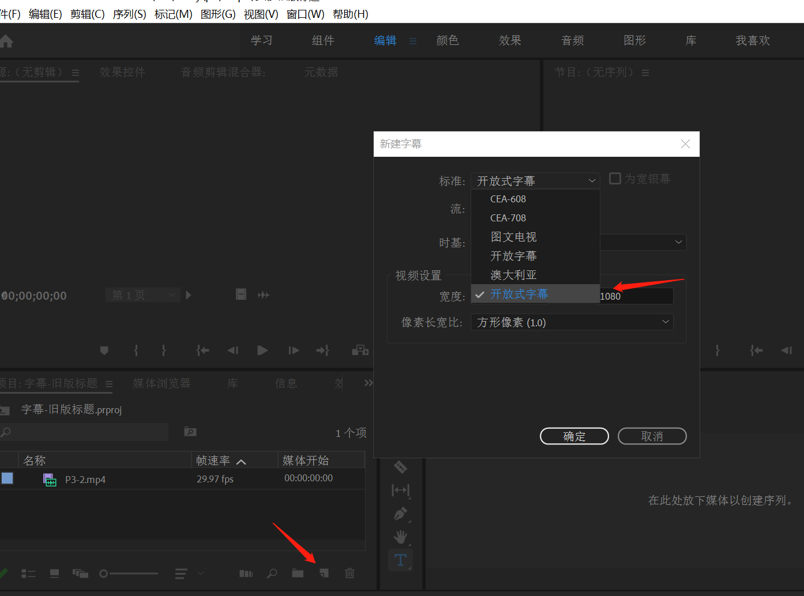
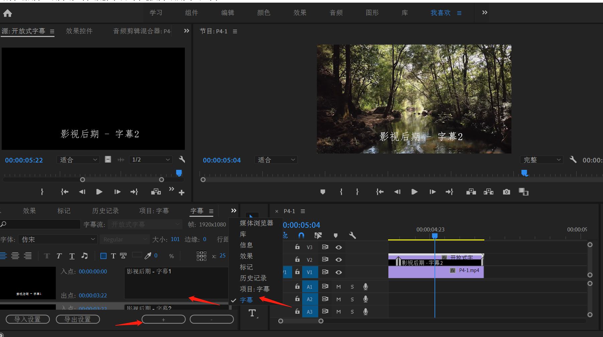
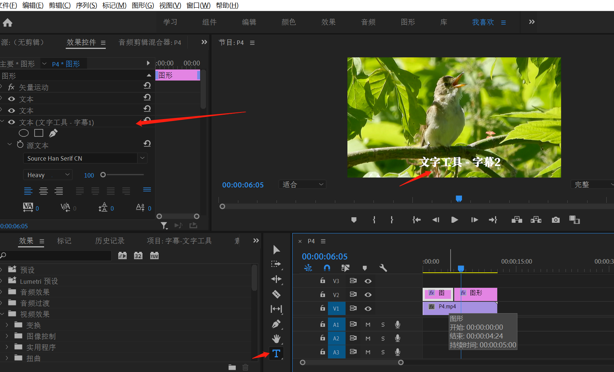
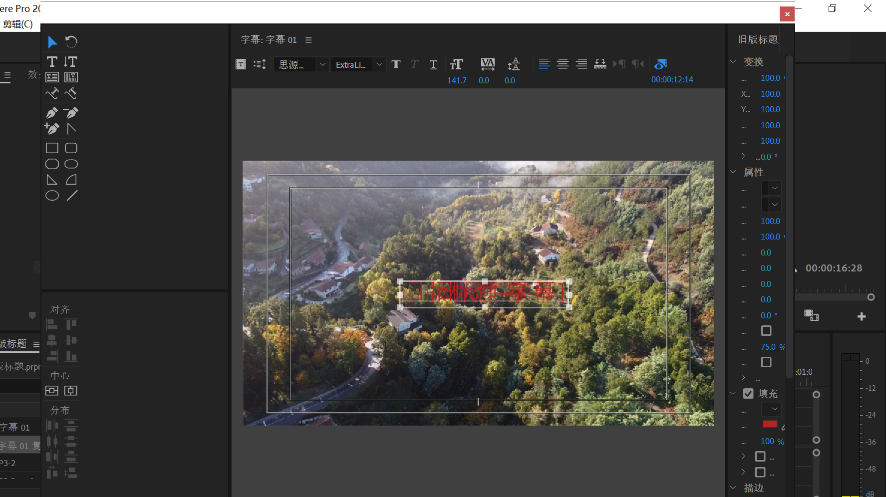
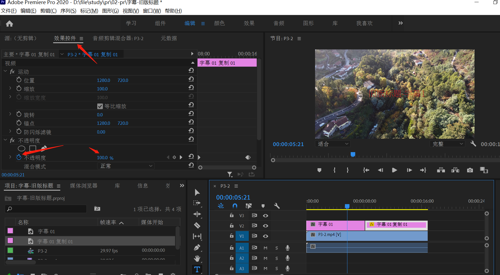
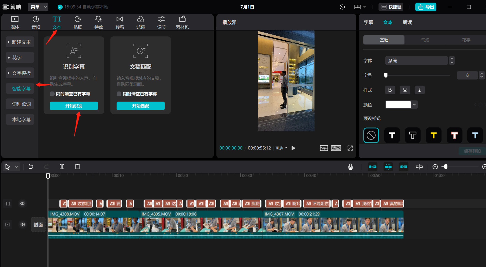

## PR - 裁剪、字幕
***

### 裁剪

#### 适用场景
混剪时不同视频存在黑边，直接放大会影响画面质量，这时候可以用裁剪，保证所有画面都有同样的黑边

 

#### 方式
- 在时间轴中选中视频，素材区域选择效果，搜索“裁剪”，复制粘贴至时间轴选择视频中，即可在素材预览区域看到效果空间，调节对应的数值即可。

- 如何将设置好的裁剪配置快速复用其他视频片段
  - 方式一：可以在素材预览区复制配置，粘贴到时间轴对应的视频中
  - 方式二：可以将视频中的所有视频片段嵌套成一个（右键选择嵌套），然后统一设置裁剪参数

 
 

### 字幕
#### 字体增加
选中文件夹中的字体右键安装即可

 

#### 增加字幕
方式一：字幕
- 在素材区打开“字幕”，编辑文字大小等样式后，拖拽至时间轴处。通过“+”号增加的其他字幕片段，和第一段是一个整体

</img>
</img>

 

方式二：文字工具
- 打开素材区的文字工具，在预览区进行文字编辑，在素材预览区可进行文字样式编辑（编辑态改为选中态） 
- 缺点：在素材预览区无法识别导入的中文字体
- 复制：
  - 在时间轴处选中字幕，按住“alt”即可进行复制（可复制样式）
  - 或者重新在视频中打字

</img>

 

方式三：旧版标题（推荐）

- 选中“文件”，“新建”，“旧版标题”，打开字幕编辑，在其中调节样式，样式调整好即可关闭，关闭即生效

- 复制：
  - 在时间轴处选中字幕，按住“alt”即可进行复制（可复制样式）

- 字体缩放：按住“shift”键进行缩放，避免图片在缩放过程中产生失真

</img>

 

#### 字幕间过渡
- 文件逐渐消失的过渡效果，可以选中图中的效果控件，点击不透明度的圈按钮，移动时间轴中到想要消失的位置，设置透明度即可

</img>

 

#### 字幕智能识别
适用于只有视频没有文字的情况下的自动识别配置字幕场景
</img>

