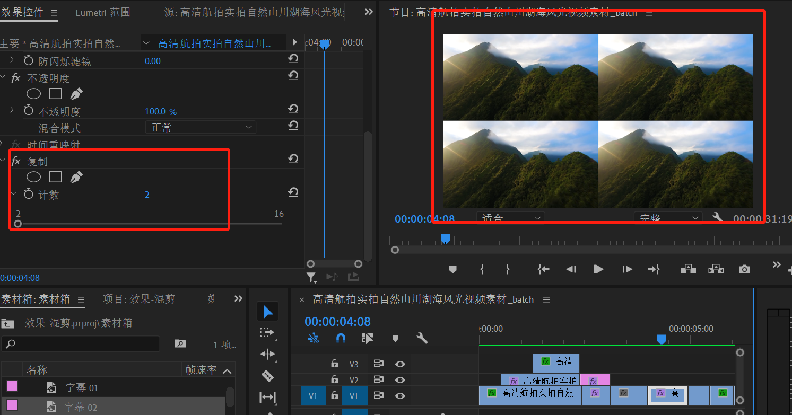
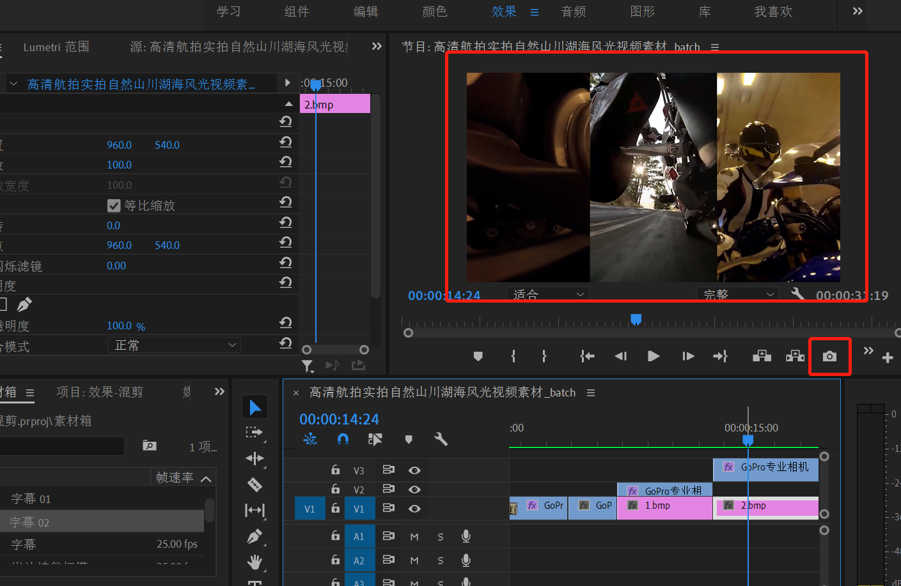

## PR - 效果控件
***

### 效果

#### 效果控件
- 打开“窗口”，选择“效果”，即可在素材区看到“效果”选项

- 音频效果

  - 降噪、混响
    - 打开素材区的效果，找到降噪、混响选项，拖拽至时间轴处，在素材预览区进行配置调整即可

  - 音量
    - 可打开素材区的效果中的音量，拖拽至时间轴处，在素材预览区进行配置调整即可
    - 在时间轴中，上下移动中线进行音量控制

  - 音频过渡
    - 控件-淡化效果

    </img>

    - 在时间轴中，按住“ctrl”加节点，上下拖拽进行音量控制

     </img>

 

- 视频过渡
  - 转场效果：安装转场插件，重启pr,即可得到比较炫酷的视频过渡效果
  - 渲染：如果增加过渡效果后视频比较卡顿，可以选中卡顿的视频区间进行渲染

  </img>

 

#### 效果控件实践

- 复制

  </img>

- 镜像

  </img>

- 轨道遮罩键

  字体在这里就是遮罩，放在哪个轨道上左侧遮罩就选择哪个

  </img>

- 颜色

  局部变色选择 `HSL` 辅助,全局变色选择基本校正。如果想在右边看到效果栏，选择菜单中的颜色即可
  
  </img>

- 动静画面拼接

  选择图中的相机进行画面截图，然后进行画面的裁剪和拼接即可出现一个画面中动静结合效果的拼接了。注意：第二张的截图是前两个画面的结合

  </img>

- RGB 曲线

  </img>

- 残影

  </img>

- VR 数字故障

  </img>

- VR 旋转球面

  </img>

- 偏移

  实现同个画面切换的效果，注意箭头标注的关键帧，即在关键地方实现切换效果，中间就会有过渡的感觉

  </img>

- 旋转扭曲

  </img>

- 镜头光晕

  可通过关键帧实现光晕移动的效果

  </img>

- 光照效果

  </img>

- 字幕缩放和透明度

  字幕出现时用缩放效果，结束时用透明度效果

  </img>

