## PR - 模板套用
***

### 快捷键

- ctrl + ~ , 预览区全屏

 

### MV 剪辑实践
#### 人物定格

  - 首先截取图片，找到蒙版，利用钢笔进行描边，最后描绘出人物蒙版。
    
    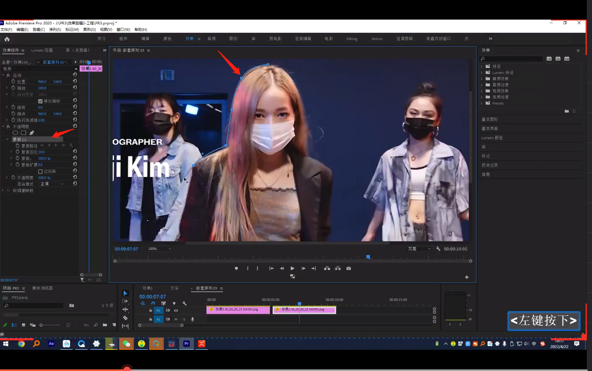</img>

  - 选中图片加嵌套（因为油漆桶读不出来蒙版）
  - 利用油漆桶给人物加白边，参数如图中所示

    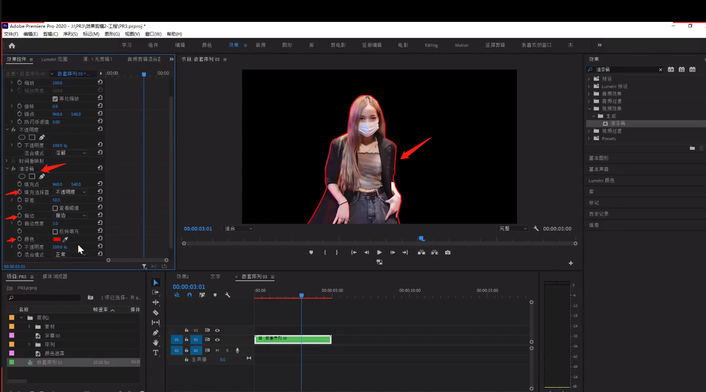</img>

 

#### 边缘变亮

  - alt 复制素材到第二个导轨
  - 查找边缘
  - 设置不透明度的混合模式为变亮

    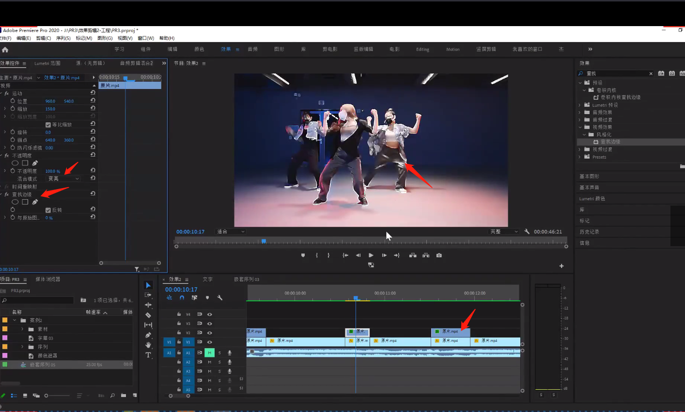</img>

  - 在关键帧处设置缩放

    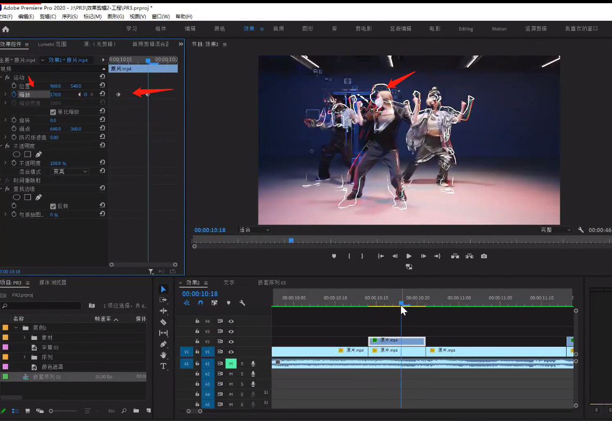</img>

 

#### 轨道遮罩

  - 查找边缘

    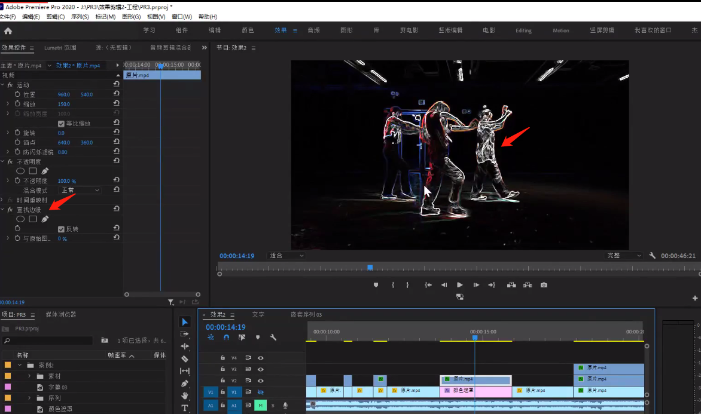</img>

  - 添加轨道遮罩（在白色处增加遮罩颜色）
    素材区新增，点击颜色遮罩，拖拽至时间轴处

    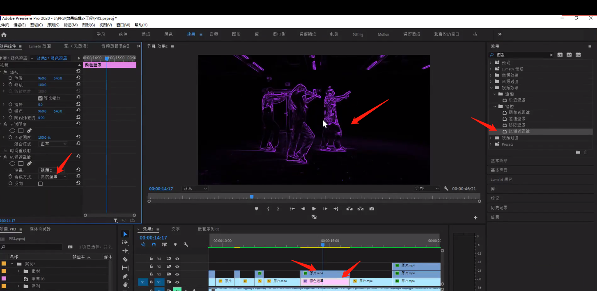</img>

 

#### 颜色平衡（RGB）
  视频有点抖音的颜色闪动效果
  
  - 将视频按 `shift` 复制三份，打开颜色平衡（RGB）
  - 每个视频的混合模式设置为变亮
  - 分别设置每个视频的红色、绿色、蓝色为100，其他两个参数为0
  - 每个视频设置缩放的关键帧，设置好了可以直接粘贴复制

    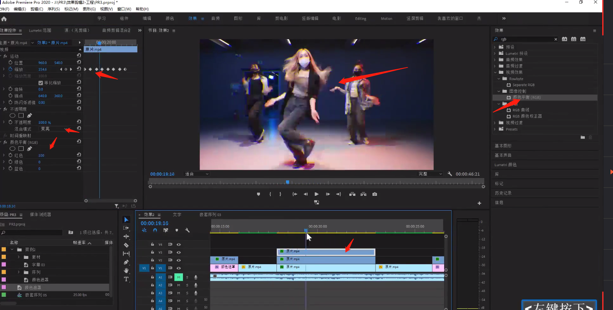</img>

 

#### 曝光过度
- 打开曝光过度效果，设置阈值为100即可
  </img>

 
 

### 视频卡顿解决
#### 常规
  - 降低预览质量：点击预览区的右下角，改完整至 1/X,不影响导出质量
    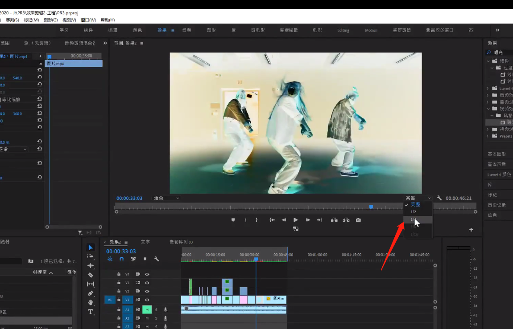</img>

  - 修改渲染程序
    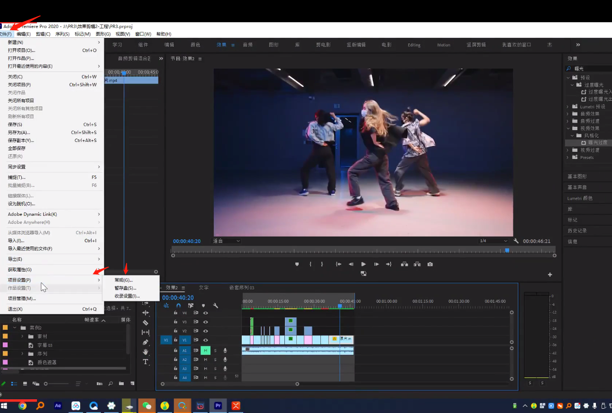</img>
    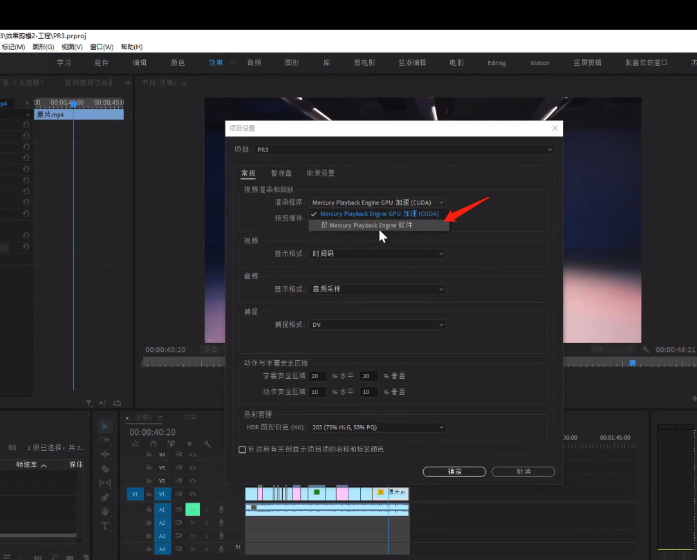</img>

  - 清除软件缓存
    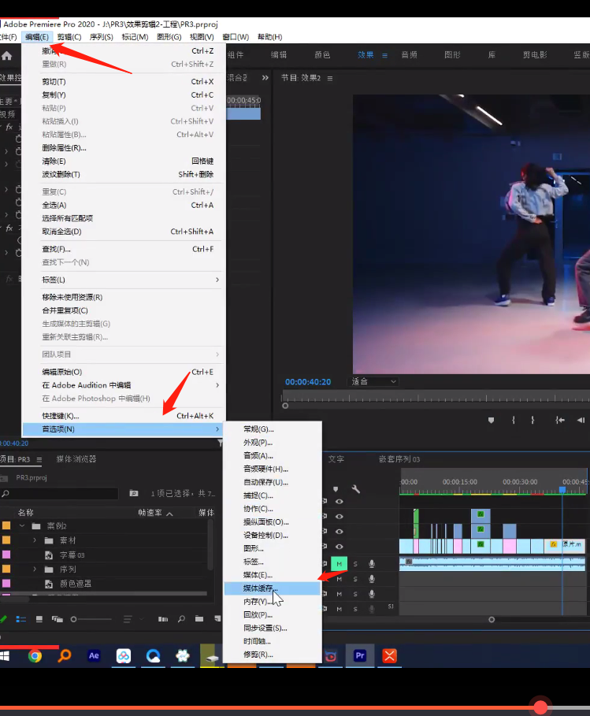</img>
    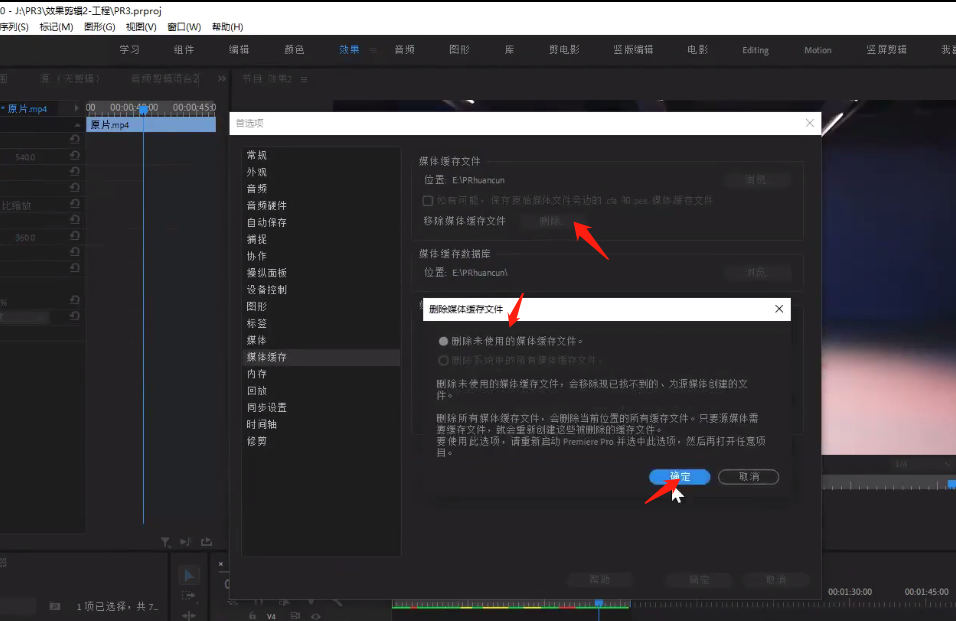</img>

  - 渲染入点到出点
    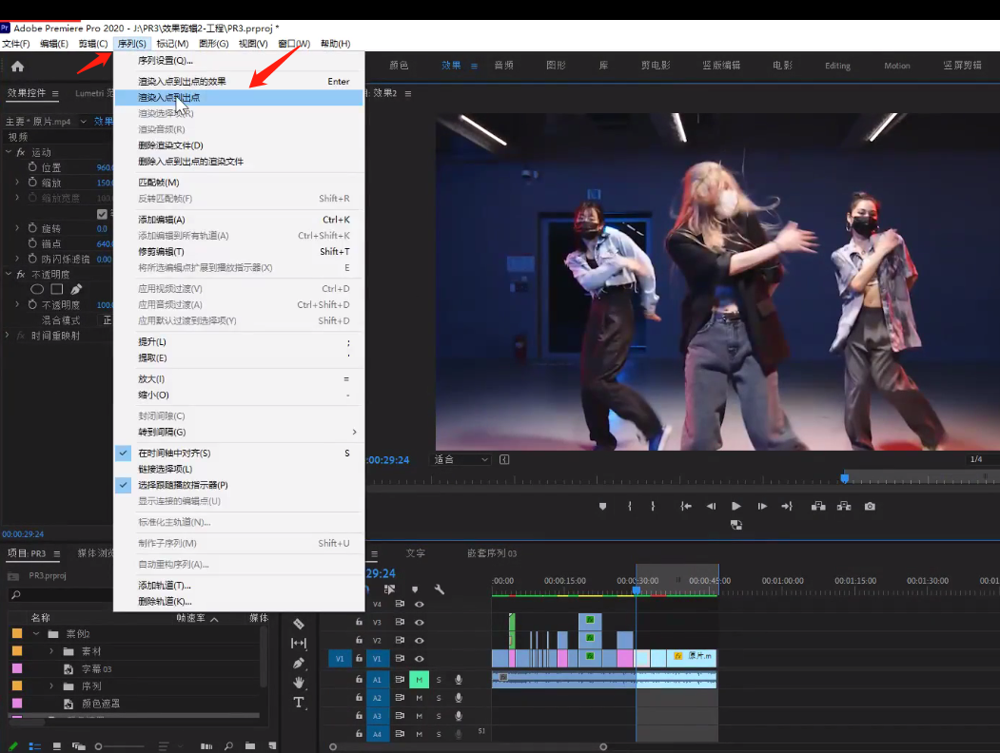</img>

#### 代理

  - 安装软件ME（Adobe Media Encode）
    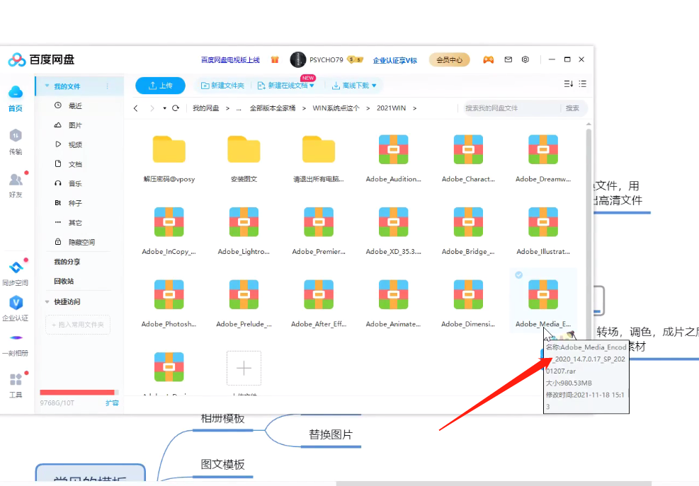</img>

  - 创建代理
    选中视频，创建代理
    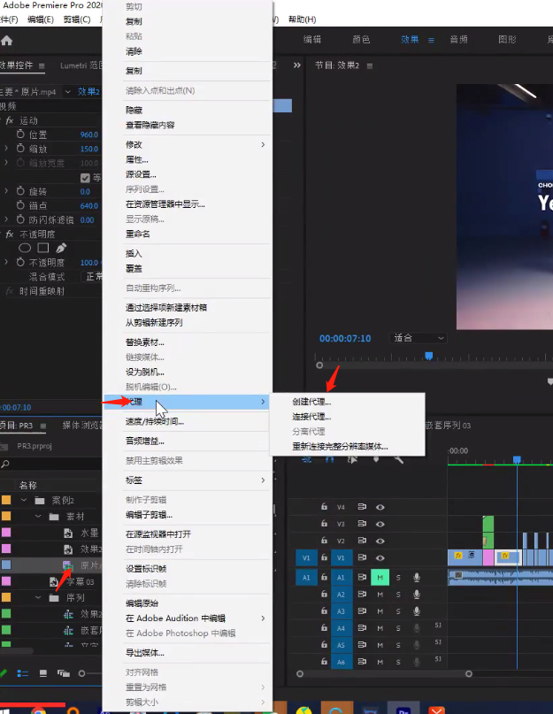</img>
    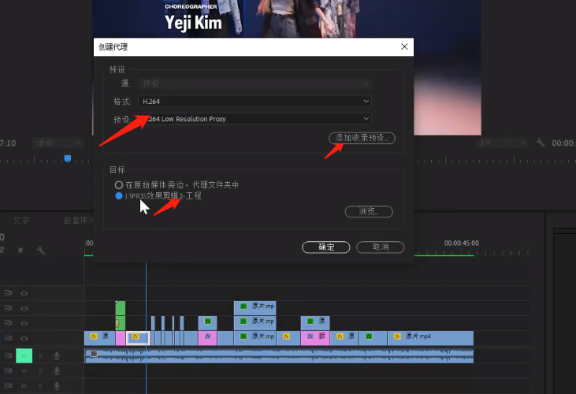</img>
    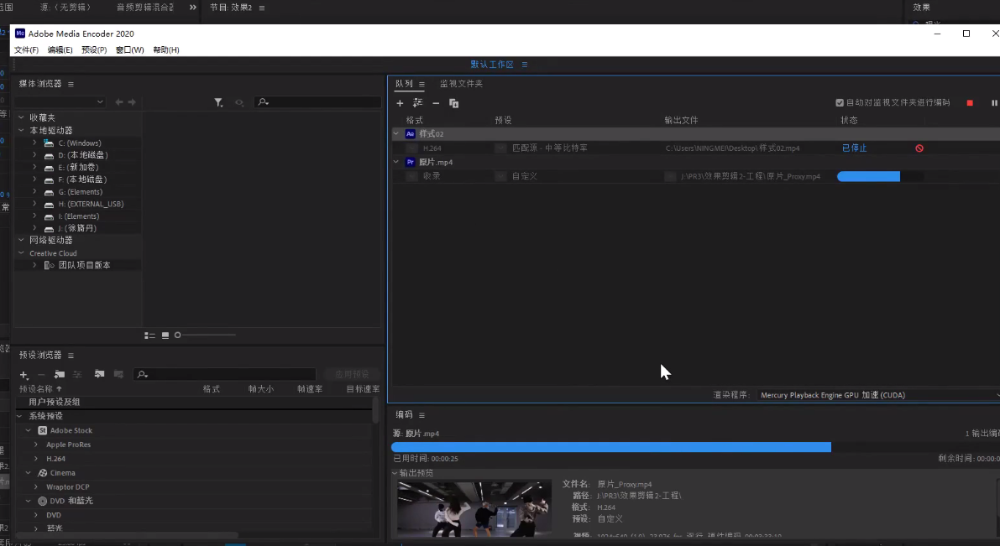</img>

